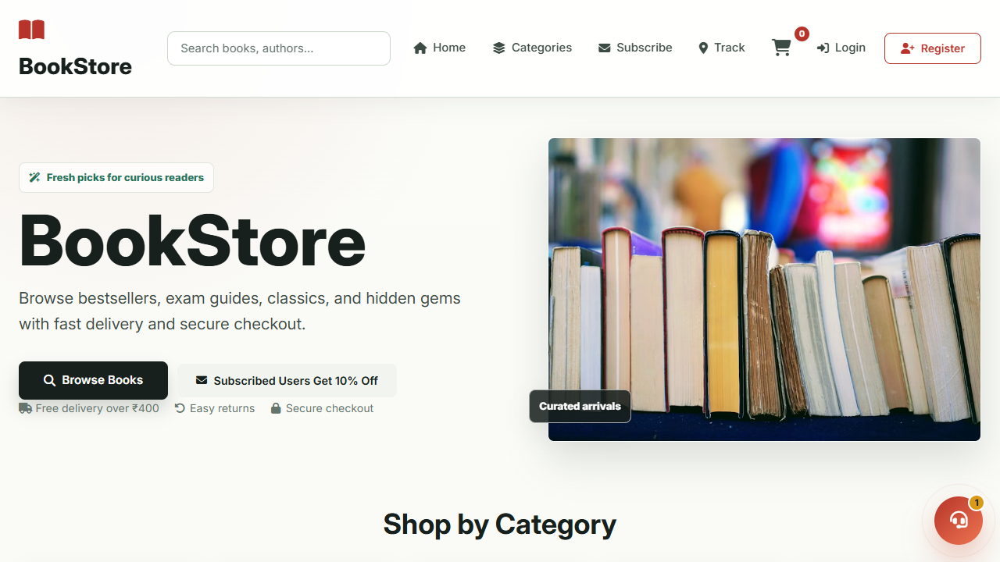
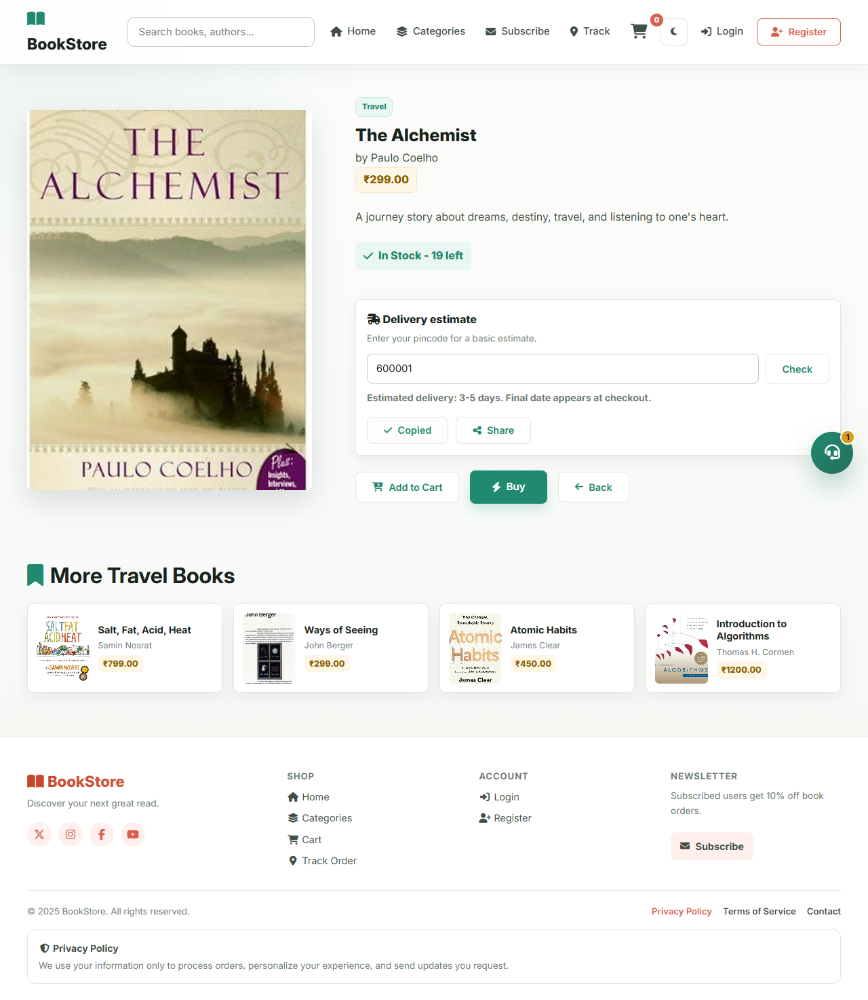
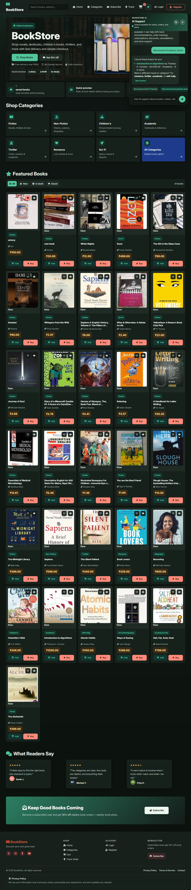
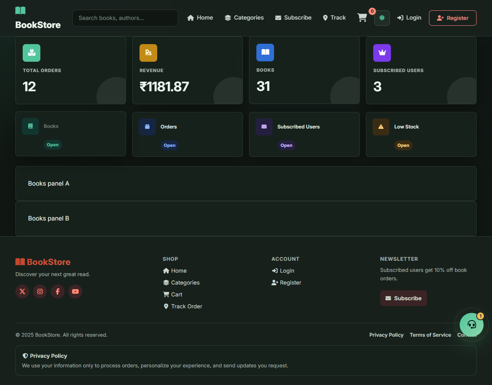
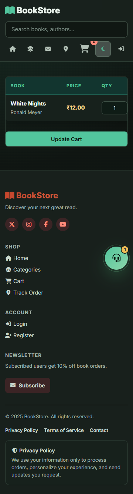

# Online BookStore

A full-featured Django online bookstore with book browsing, category filtering, cart checkout, Razorpay/COD payments, subscriptions, subscribed-user discounts, order tracking, invoices, AI support, dark/light themes, mobile-friendly layouts, and a staff admin dashboard.

## Screenshots

### Home Page



### Book Detail



### AI Support



### Admin Dashboard



### Cart



## Main Features

- Book catalog with search, categories, smart filters, sorting, and stock badges.
- Home hero image rotator that changes images every 15 seconds.
- Wishlist/saved books shelf using browser storage.
- Recently viewed books.
- Quick book preview modal.
- Book detail page with related books, delivery estimate, copy link, and share button.
- Cart with auto quantity update, readable light/dark colors, and mobile scrolling.
- Checkout using Razorpay or Cash on Delivery.
- Active subscribed users receive an automatic 10% discount on eligible book orders.
- Subscription plans with paid activation and expiry.
- Order history, order tracking, cancellation, and invoice/bill pages.
- AI customer support widget with Gemini support when configured and local fallback replies.
- Staff dashboard for books, orders, subscribed users, and low stock.
- Admin page inner tabs for Books, Orders, Subscribed Users, and Low Stock.
- Light/dark theme toggle.
- Mobile responsive layout across home, cart, detail, admin, and support pages.

## Tech Stack

- Python
- Django
- SQLite for local development
- HTML templates
- CSS
- JavaScript
- Razorpay checkout integration
- Optional Gemini API integration
- Playwright CLI for browser verification screenshots

## Project Structure

```text
online-bookstore/
  backend/
    bookstore_project/
      settings.py
      urls.py
    store/
      models.py
      views.py
      forms.py
      urls.py
      admin.py
      migrations/
  frontend/
    templates/store/
      base.html
      home.html
      book_detail.html
      cart.html
      order_history.html
      admin_dashboard.html
      subscribe.html
    static/
      js/
        main.js
        support.js
      store/css/
        style.css
        support.css
  output/playwright/
    verified screenshots and browser-check scripts
  manage.py
  requirements.txt
  .env.example
  README.md
```

## Local Setup

```powershell
python -m venv .venv
.\.venv\Scripts\Activate.ps1
pip install -r requirements.txt
copy .env.example .env
python manage.py migrate
python manage.py createsuperuser
python manage.py runserver
```

Open:

```text
http://127.0.0.1:8000/
```

If port `8000` is already in use:

```powershell
python manage.py runserver 8001
```

Open:

```text
http://127.0.0.1:8001/
```

## React Frontend

A React/Vite frontend is available in `frontend/react-app`. It uses the Django app for JSON APIs, sessions, cart data, checkout, auth, and subscription flows.

Run Django first:

```powershell
python manage.py runserver
```

Then run React in another terminal:

```powershell
cd frontend\react-app
npm install
npm run dev
```

Open:

```text
http://127.0.0.1:5173/
```

Build React for production:

```powershell
cd frontend\react-app
npm run build
```

## Environment Variables

Copy `.env.example` to `.env`.

```powershell
copy .env.example .env
```

Common variables:

| Variable | Purpose |
| --- | --- |
| `SECRET_KEY` | Django secret key |
| `DEBUG` | Use `True` locally, `False` in production |
| `ALLOWED_HOSTS` | Comma-separated allowed hosts |
| `RAZORPAY_KEY_ID` | Razorpay public key |
| `RAZORPAY_KEY_SECRET` | Razorpay private secret |
| `GEMINI_API_KEY` | Optional Gemini support for AI chat |
| `GEMINI_MODEL` | Gemini model name |
| `EMAIL_*` | Optional email settings |
| `DEFAULT_FROM_EMAIL` | Sender email |
| `SOCIAL_AUTH_*` | Optional social login settings |

## Useful Commands

```powershell
python manage.py check
python manage.py makemigrations
python manage.py migrate
python manage.py createsuperuser
python manage.py runserver
python manage.py test store
```

## User Flow

1. User opens the home page.
2. User searches or filters books.
3. User opens a book detail page or quick preview.
4. User saves books, checks delivery estimate, or shares the book link.
5. User adds books to cart or clicks Buy.
6. User checks out with Razorpay or Cash on Delivery.
7. User tracks the order from order history or the tracking page.
8. User can cancel eligible pending/processing orders.
9. User can subscribe to receive 10% off eligible orders.

## Subscription Flow

1. User opens `/subscribe/`.
2. User selects monthly, quarterly, or yearly plan.
3. User submits name, email, mobile number, and reading interests.
4. App creates or updates the subscriber record.
5. User completes payment.
6. Subscriber becomes active and receives an expiry date.
7. Matching signed-in users receive the 10% checkout discount.

## Subscribed-User Discount Rules

The 10% discount applies only when:

- The customer is signed in.
- The signed-in user has an email address.
- A `Subscriber` record exists for that email.
- The subscriber is active.
- The subscription is paid.
- The subscription is not expired.

The order stores:

- `subtotal_amount`
- `discount_amount`
- `total_amount`

Invoices and checkout pages show the discount when applicable.

## Payment Behavior

### Razorpay

Razorpay orders are created as awaiting payment first.

Before payment succeeds:

- Order is not confirmed.
- Stock is not reserved.
- Bill is not shown.
- User can retry payment from order history.

After payment succeeds:

- Order becomes paid.
- Stock is reserved.
- Order status becomes processing.
- Tracking number is created.
- Bill becomes available.

### Cash on Delivery

COD orders are confirmed immediately because online payment is not required.

## AI Support

The AI support widget is available on all pages through the base template.

Endpoint:

```text
/support/chat/
```

With `GEMINI_API_KEY`, the widget can use Gemini with limited store context:

- current user type,
- active subscription state,
- subscription plan prices,
- matching books,
- recent authenticated-user orders.

Without Gemini, the app uses local fallback replies for:

- book recommendations,
- order tracking,
- cancellation help,
- subscription plans,
- 10% discount questions,
- contact information,
- privacy and terms.

## Admin Dashboard

Staff users can open the custom admin dashboard.

Features:

- Summary cards for total orders, revenue, books, and subscribed users.
- Clickable dashboard cards.
- Inner tabs for:
  - Books
  - Orders
  - Subscribed Users
  - Low Stock
- Add new books.
- Search/manage books.
- Update order status and payment status.
- Open bills.
- View low-stock books.
- Activate/deactivate subscribers.
- Link to Django Admin.

The standard Django admin is also available at:

```text
/admin/
```

## Theme And Mobile UI

The site includes:

- light/dark theme toggle,
- dark theme support for cart, admin, order history, support widget, categories, and subscription page,
- responsive mobile layouts,
- mobile-friendly book detail page,
- mobile cart table scrolling,
- compact admin tabs and panels.

## Verified Screenshots

The `output/playwright/` folder contains screenshots captured during browser verification.

Useful files:

```text
output/playwright/bookstore-home-final.png
output/playwright/basic-features-book-detail.png
output/playwright/ai-support-dark-updated.png
output/playwright/admin-inner-tabs.png
output/playwright/cart-colors-dark.png
output/playwright/saved-shelf-home.png
output/playwright/hero-rotator.png
```

## Browser Verification

This project has been checked with Playwright CLI scripts stored in `output/playwright/`.

Examples:

```powershell
npx --yes --package @playwright/cli playwright-cli run-code --filename output\playwright\verify_mobile_after.js
npx --yes --package @playwright/cli playwright-cli run-code --filename output\playwright\verify_admin_inner_tabs.js
npx --yes --package @playwright/cli playwright-cli run-code --filename output\playwright\verify_cart_colors.js
```

## GitHub Setup

This repository is ready for GitHub.

Included GitHub-friendly files:

- `.gitignore` for secrets, virtual environments, local databases, cache files, and generated local scripts.
- `.env.example` for safe environment variable documentation.
- `.github/workflows/django.yml` for Django CI.
- `CONTRIBUTING.md` for local development and pull request checks.

Before pushing:

```powershell
git status
python manage.py check
python manage.py test store
```

Recommended first push:

```powershell
git add .
git commit -m "Prepare bookstore project for GitHub"
git branch -M main
git remote add origin https://github.com/<your-username>/<your-repo>.git
git push -u origin main
```

Do not commit:

- `.env`
- `.venv/`
- `venv/`
- `db.sqlite3`
- `.playwright-cli/`

## Git Hygiene

Virtual environments should not be committed.

Ignored folders:

```text
.venv/
venv/
```

If a virtual environment was already tracked:

```powershell
git rm -r --cached .venv venv
git commit -m "Remove virtual environments from repository"
```

Keep dependencies in:

```text
requirements.txt
```

## Development Notes

- Main backend logic is in `backend/store/views.py`.
- Main models are in `backend/store/models.py`.
- Main shared template is `frontend/templates/store/base.html`.
- Main UI styles are in `frontend/static/store/css/style.css`.
- Support widget styles are in `frontend/static/store/css/support.css`.
- Main frontend behavior is in `frontend/static/js/main.js`.
- Support chat behavior is in `frontend/static/js/support.js`.
